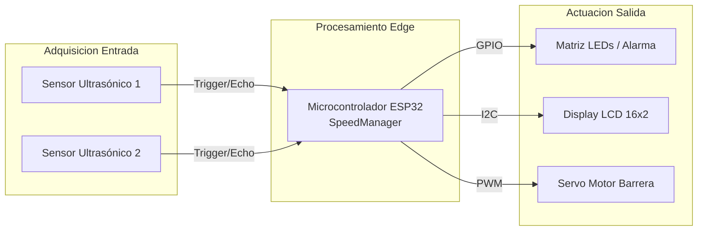
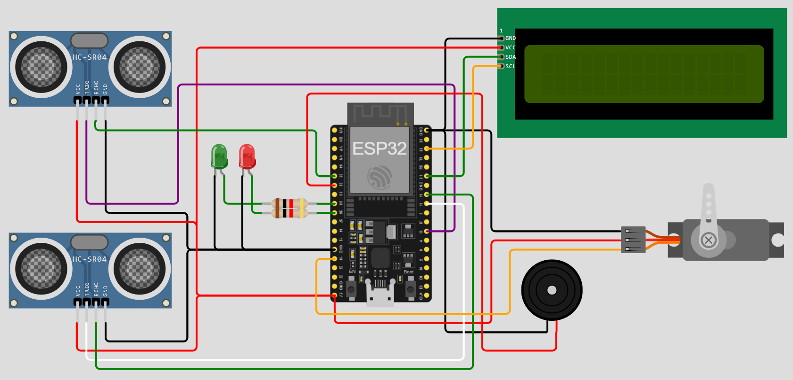
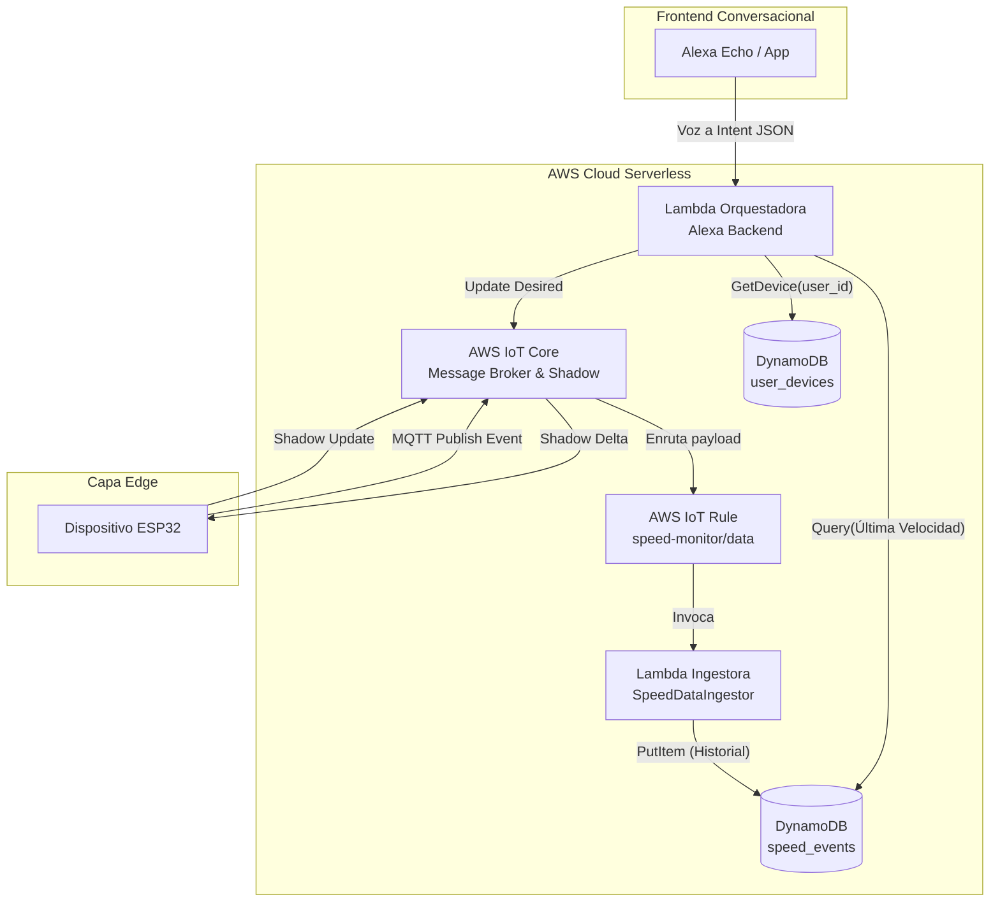
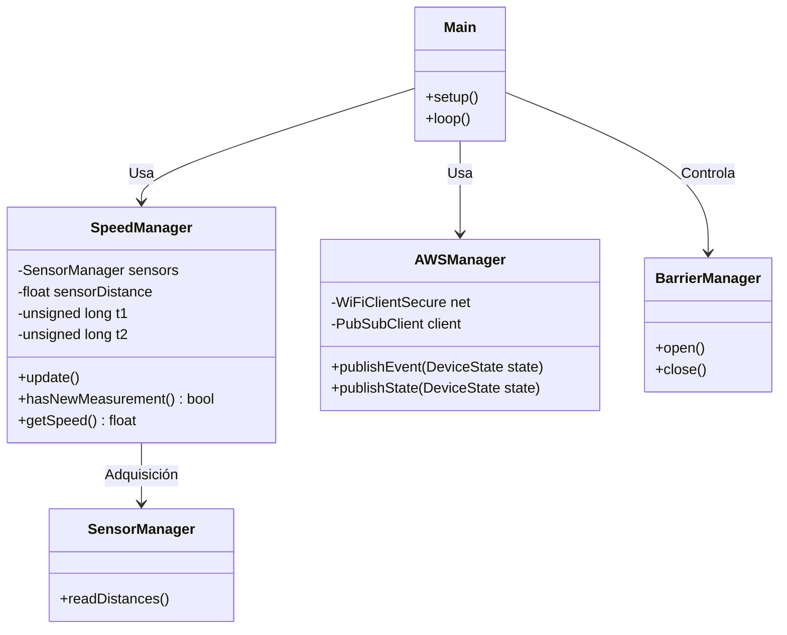
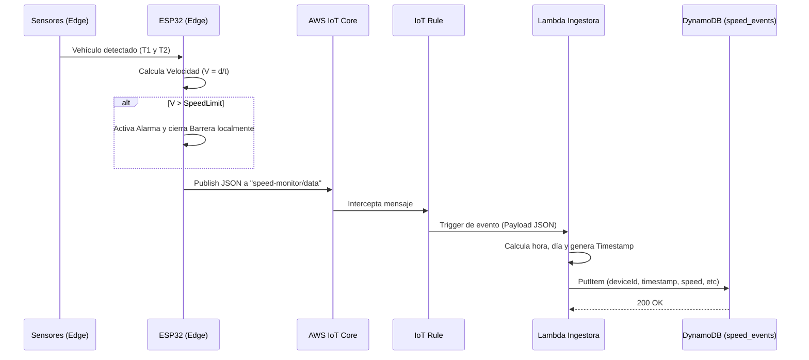
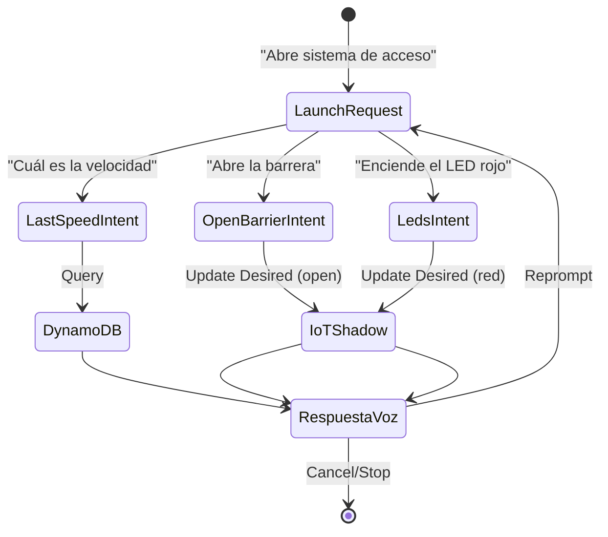
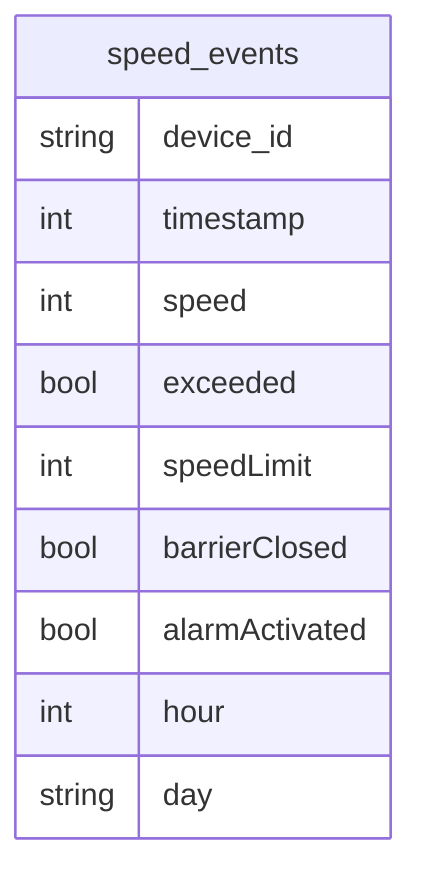

# Practica_4

# 1. Requerimientos Funcionales y No Funcionales
* Funcionales
      
    * Detección de vehículos:El sistema deberá detectar la presencia de un vehículo mediante un sensor conectado al ESP32.

    * Medición de velocidad: El sistema deberá calcular la velocidad del vehículo en tiempo real a partir de los sensores instalados.

    * Comparación con límite de velocidad: El sistema deberá comparar la velocidad detectada con un límite de velocidad configurado remotamente.

    * Activación de alarma: El sistema deberá activar una alarma sonora cuando la velocidad del vehículo supere el límite establecido.

    * Control de barrera automática: El sistema deberá controlar un servomotor que actúa como barrera, cerrándola cuando se detecte exceso de velocidad.
  
* No Funcionales
      
    * Seguridad: Toda comunicación entre el ESP32 y AWS IoT Core deberá estar cifrada mediante TLS 1.2 usando certificados digitales.
     
    * Disponibilidad: El sistema deberá mantener conexión con AWS IoT Core con reconexión automática en caso de pérdida de conexión.
      
    * Eficiencia energética: El ESP32 deberá optimizar el uso de red evitando publicaciones innecesarias y reduciendo tráfico MQTT.
      
    * Mantenibilidad: El código deberá estar modularizado en componentes separados (sensor, AWSManager, actuadores) para facilitar mantenimiento.
  
# 2. Diseño del Sistema
* Diagrama de bloques
    


* Diagrama de circuito
    


* Diagrama de arquitectura del sistema



* Diagramas estructurales y de comportamiento




* Diseño de la skill de Alexa
     


* Diseño de reportes (mockups) con información relevante para la toma de decisiones

```json
    {
        "state": {
            "desired": {
            "speedLimit": 10
            },
            "reported": {
            "deviceId": "speed-01",
            "systemStatus": "online",
            "currentSpeed": 3.98,
            "speedLimit": 10,
            "alarm": false,
            "barrier": "open"
            }
        }
    }
```

* Diseño del modelo de datos (tablas, tipos de datos, claves, etc.) para DynamoDB
    

Descripción de las tablas

| Campo          | Tipo    | Clave | Descripción                                            |
| -------------- | ------- | ----- | ------------------------------------------------------ |
| device_id      | String  | PK    | Identificador del dispositivo que generó el evento.    |
| timestamp      | Number  | SK    | Marca temporal Unix Epoch del evento.                  |
| speed          | Number  | -     | Velocidad capturada por el sensor.                     |
| exceeded       | Boolean | -     | Indica si la velocidad excedió el límite configurado.  |
| speedLimit     | Number  | -     | Límite de velocidad vigente al momento de la medición. |
| barrierClosed  | Boolean | -     | Estado de la barrera durante el evento.                |
| alarmActivated | Boolean | -     | Estado de la alarma durante el evento.                 |
| hour           | Number  | -     | Hora del día utilizada para análisis y reportes.       |
| day            | String  | -     | Día de la semana asociado al evento.                   |


# 3. Implementación
  * Código fuente documentado (firmware del Objeto Inteligente y lógica del backend en las funciones Lambda)
 
  * Configuraciones en Alexa (Skill e Interaction Model)
   
  * Configuraciones en AWS (IoT Core, Rules, Lambda y DynamoDB)
   
# 4. Pruebas y Validaciones

# 5. Resultados

# 6. Conclusiones

# 7. Recomendaciones

# 8. Anexos
