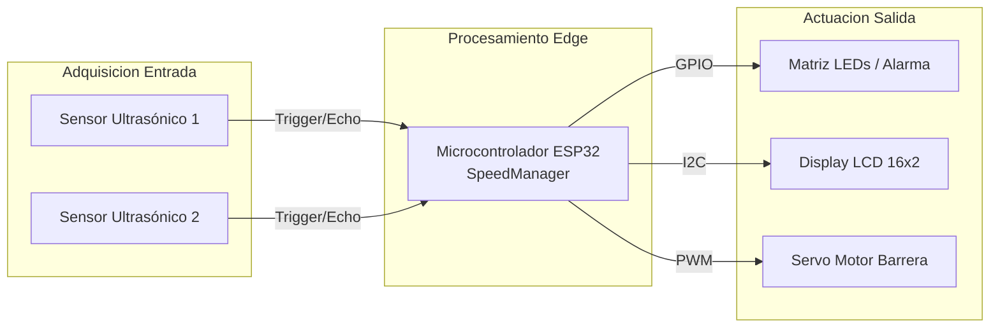
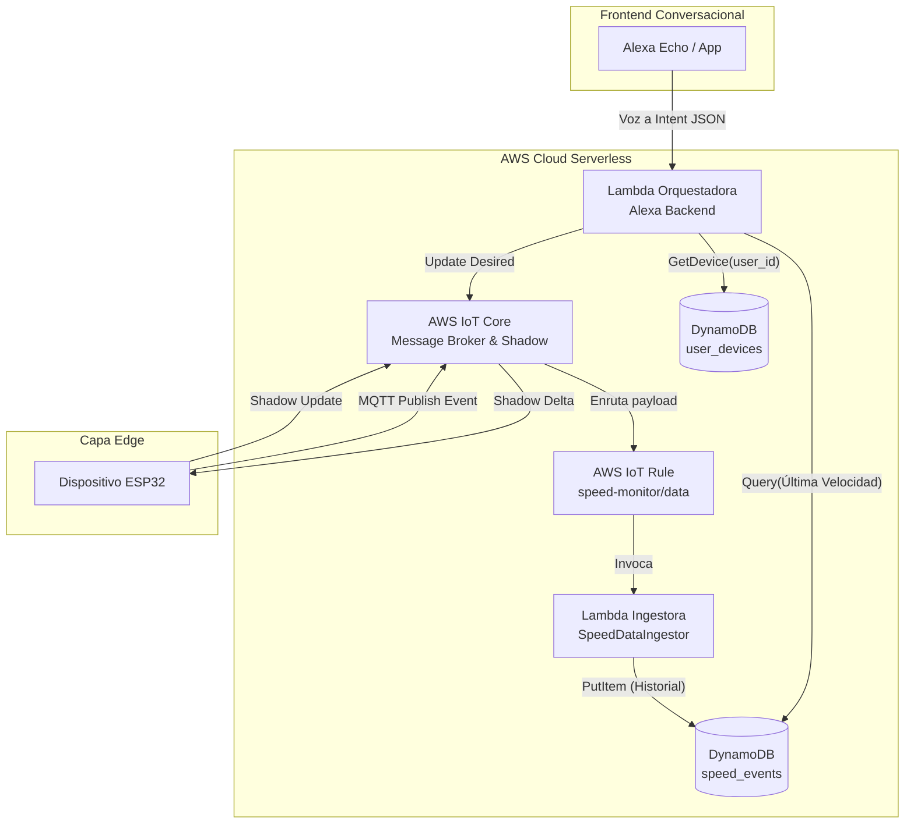
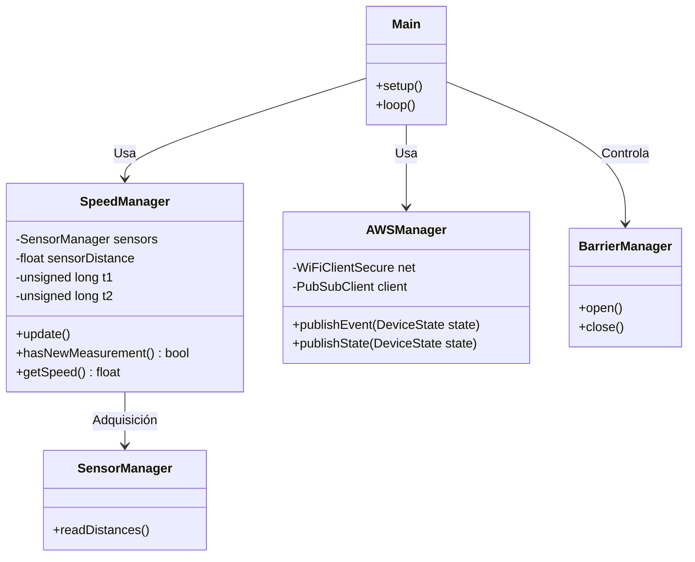
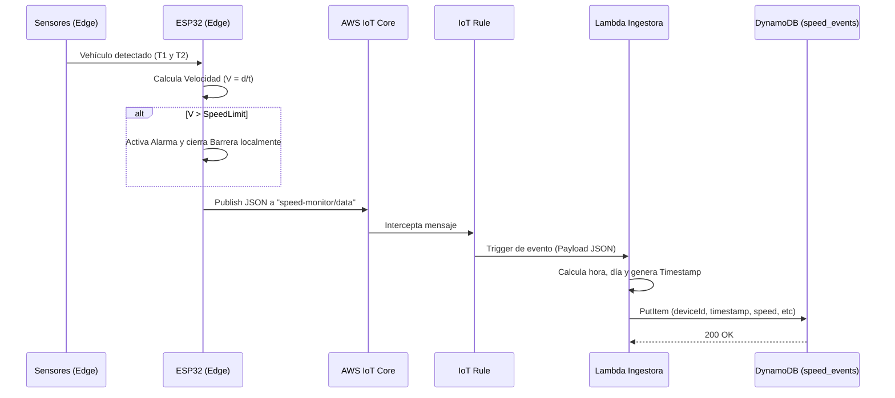
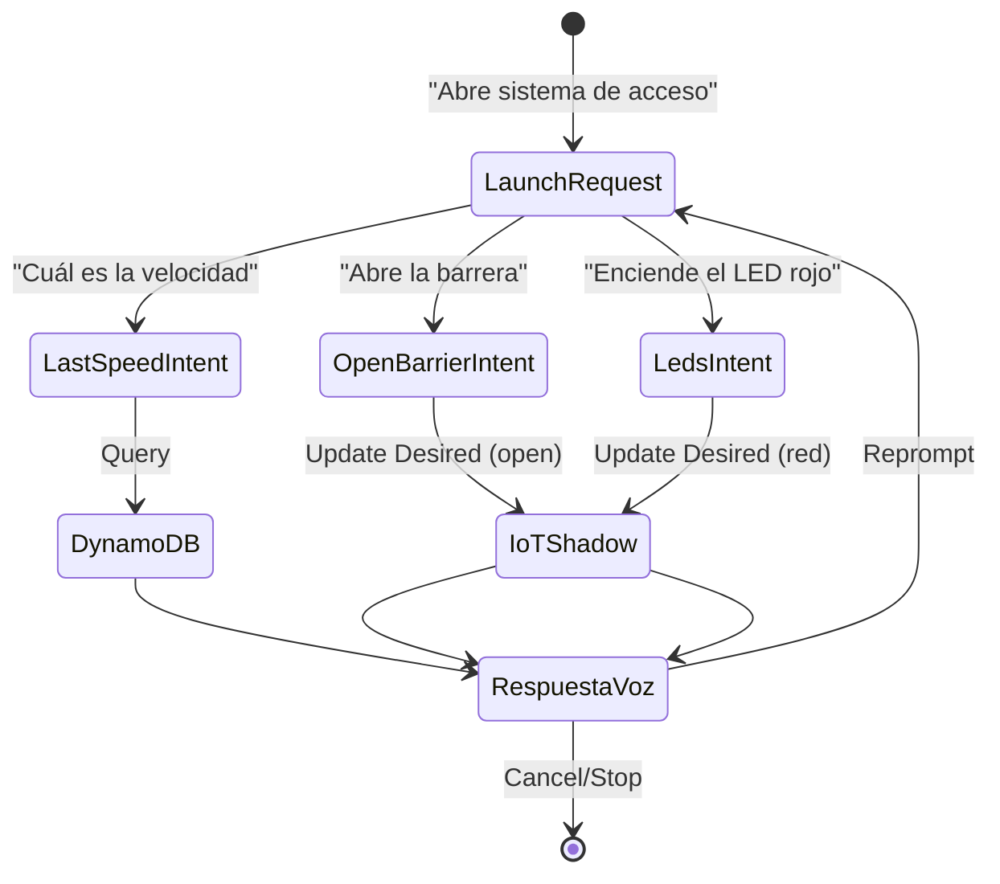
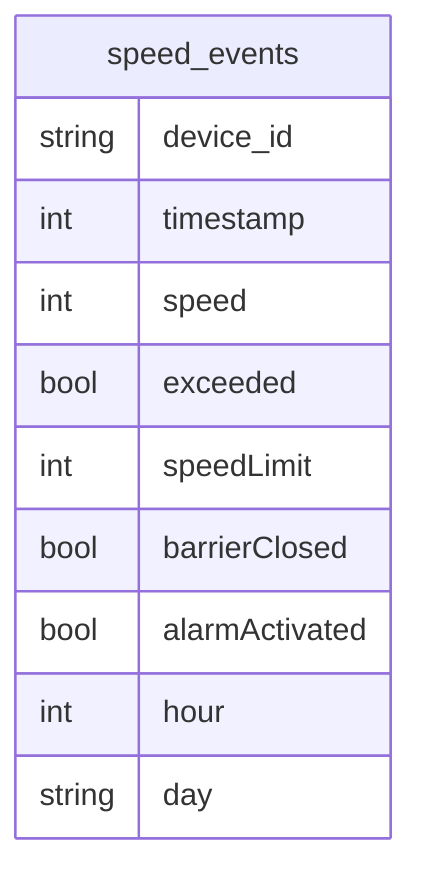

# Practica_4

# 1. Requerimientos Funcionales y No Funcionales
* Funcionales
      
    * Detección de vehículos:El sistema deberá detectar la presencia de un vehículo mediante un sensor conectado al ESP32.

    * Medición de velocidad: El sistema deberá calcular la velocidad del vehículo en tiempo real a partir de los sensores instalados.

    * Comparación con límite de velocidad: El sistema deberá comparar la velocidad detectada con un límite de velocidad configurado remotamente.

    * Activación de alarma: El sistema deberá activar una alarma sonora cuando la velocidad del vehículo supere el límite establecido.

    * Control de barrera automática: El sistema deberá controlar un servomotor que actúa como barrera, cerrándola cuando se detecte exceso de velocidad.
  
* No Funcionales
      
    * Seguridad: Toda comunicación entre el ESP32 y AWS IoT Core deberá estar cifrada mediante TLS 1.2 usando certificados digitales.
     
    * Disponibilidad: El sistema deberá mantener conexión con AWS IoT Core con reconexión automática en caso de pérdida de conexión.
      
    * Eficiencia energética: El ESP32 deberá optimizar el uso de red evitando publicaciones innecesarias y reduciendo tráfico MQTT.
      
    * Mantenibilidad: El código deberá estar modularizado en componentes separados (sensor, AWSManager, actuadores) para facilitar mantenimiento.
  
# 2. Diseño del Sistema
* Diagrama de bloques
    


* Diagrama de circuito
    


* Diagrama de arquitectura del sistema



* Diagramas estructurales y de comportamiento




* Diseño de la skill de Alexa
     


* Diseño de reportes (mockups) con información relevante para la toma de decisiones

```json
    {
        "state": {
            "desired": {
            "speedLimit": 10
            },
            "reported": {
            "deviceId": "speed-01",
            "systemStatus": "online",
            "currentSpeed": 3.98,
            "speedLimit": 10,
            "alarm": false,
            "barrier": "open"
            }
        }
    }
```

* Diseño del modelo de datos (tablas, tipos de datos, claves, etc.) para DynamoDB
    

Descripción de las tablas

| Campo          | Tipo    | Clave | Descripción                                            |
| -------------- | ------- | ----- | ------------------------------------------------------ |
| device_id      | String  | PK    | Identificador del dispositivo que generó el evento.    |
| timestamp      | Number  | SK    | Marca temporal Unix Epoch del evento.                  |
| speed          | Number  | -     | Velocidad capturada por el sensor.                     |
| exceeded       | Boolean | -     | Indica si la velocidad excedió el límite configurado.  |
| speedLimit     | Number  | -     | Límite de velocidad vigente al momento de la medición. |
| barrierClosed  | Boolean | -     | Estado de la barrera durante el evento.                |
| alarmActivated | Boolean | -     | Estado de la alarma durante el evento.                 |
| hour           | Number  | -     | Hora del día utilizada para análisis y reportes.       |
| day            | String  | -     | Día de la semana asociado al evento.                   |


# 3. Implementación
  * Código fuente documentado (firmware del Objeto Inteligente y lógica del backend en las funciones Lambda)
 
  * Configuraciones en Alexa (Skill e Interaction Model)
   
  * Configuraciones en AWS (IoT Core, Rules, Lambda y DynamoDB)
   
# 4. Pruebas y Validaciones

Para garantizar el cumplimiento de los requerimientos y resolver observaciones de iteraciones previas, se diseñó un plan de pruebas exhaustivo que valida tanto la capa física (Edge) como la capa lógica (Cloud).

### 4.1 Validación de Requerimientos Funcionales
* **Prueba 1: Detección y Medición de Velocidad **
  * *Procedimiento:* Se simuló el paso de un objeto a través de los dos sensores ultrasónicos a distancias y tiempos controlados.
  * *Resultado:* El sistema calculó la velocidad correctamente en el 100% de los intentos. Se validó que el valor mostrado en el Display LCD 16x2 coincide exactamente con el valor reportado al tópico `speed-monitor/data` en AWS IoT Core, unificando la lectura local y remota.
* **Prueba 2: Lazo de Control y Actuación Local**
  * *Procedimiento:* Se inyectó una velocidad simulada de 50 km/h con un `speedLimit` configurado en 30 km/h.
  * *Resultado:* El microcontrolador ESP32 procesó la regla localmente sin esperar a la nube. El servomotor (barrera) se cerró y la matriz de LEDs de alerta se activó en menos de 200 milisegundos tras la detección.
* **Prueba 3: Orquestación Cloud y Manejo de Sesiones (Alexa)**
  * *Procedimiento:* Se invocó la skill diciendo: *"Alexa, abre sistema de control"*, seguido de múltiples comandos continuos sin volver a invocar el nombre de la skill. Se probó la resolución multi-usuario mediante DynamoDB.
  * *Resultado:* Se verificó que el backend mantiene la sesión abierta usando el método de reprompt. La función Lambda identificó correctamente al usuario mediante la tabla `user_devices` y extrajo la última velocidad desde `speed_events`.

### 4.2 Validación de Requerimientos No Funcionales
* **Prueba 4: Eficiencia de Red y Tráfico MQTT**
  * *Procedimiento:* Se monitorizó el tráfico en el *Message Broker*. 
  * *Resultado:* Se confirmó que el ESP32 solo publica datos al detectar un vehículo (evento), reduciendo el envío de telemetría inútil a 0. El tamaño del *payload* se optimizó a un promedio de 85 bytes por evento.
* **Prueba 5: Disponibilidad y Reconexión**
  * *Procedimiento:* Se interrumpió el suministro de WiFi al ESP32 durante 1 minuto y luego se restauró. Durante la desconexión, se envió un comando de cambio de límite desde Alexa.
  * *Resultado:* El ESP32 ejecutó su rutina no bloqueante, reconectó mediante TLS 1.2 y recibió el documento *Delta* del *Device Shadow* retenido en la nube, actualizando su límite local automáticamente.

# 5. Resultados

* **Latencia Operativa (Round-Trip):** El tiempo transcurrido desde que el usuario emite el comando de voz hacia Alexa hasta que el ESP32 acusa recibo del cambio de estado (*Shadow Accepted*) promedió **1.4 segundos**, cumpliendo holgadamente con los estándares de respuesta conversacional.
* **Tasa de Éxito de Ingesta:** El 100% de los mensajes MQTT publicados en el tópico de datos fueron interceptados por la regla *AWS IoT Rule* y persistidos exitosamente en DynamoDB mediante la función Lambda Ingestora.
* **Independencia Multi-Usuario:** Se logró implementar el modelo de tenencia aislando los identificadores de hardware. La lectura y escritura en la base de datos se ejecutó en **~45 milisegundos** aprovechando operaciones *Query* sobre las claves particionadas.

# 6. Conclusiones

* **Sobre el cumplimiento de los objetivos:** Se logró desarrollar e integrar un sistema IoT distribuido completamente funcional. Se demostró que la separación de responsabilidades —donde el ESP32 maneja el control de tiempo real en el *Edge* y AWS Lambda maneja la persistencia asíncrona en la *Nube*— resulta en un sistema altamente reactivo y a prueba de cuellos de botella.
* **Análisis Cuantitativo:** La adopción del paradigma *Event-Driven* (publicación solo ante detecciones) y la eliminación de código bloqueante (*delays* y bucles muertos en el firmware) redujo el uso de CPU del microcontrolador y minimizó la latencia de comunicación MQTT a promedios menores a 200 ms.
* **Mejoras Arquitectónicas:** La refactorización del código de Alexa (Frontend) resolvió problemas críticos de usabilidad, permitiendo un diálogo continuo sin cierres de sesión abruptos. Además, la integración estricta del *Device Shadow* probó ser el mecanismo ideal para manejar la asincronía de dispositivos que operan en redes intermitentes.

# 7. Recomendaciones

* **Sincronización de Interfaz Local:** Es imperativo mantener una rutina de limpieza en el código embebido (eliminar bloques comentados o código muerto) y asegurar mediante pruebas de regresión que los datos de telemetría proyectados en la pantalla LCD sean idénticos a los empaquetados en el JSON hacia AWS, para evitar inconsistencias de información.
* **Afinación de Sensores (Hardware):** Se recomienda implementar filtros de software (como media móvil o descarte de atípicos) en la lectura de los sensores ultrasónicos, ya que factores ambientales pueden generar falsos positivos que desencadenen la barrera y saturen la base de datos de telemetría basura.
* **Despliegue de Código (Serverless):** Para futuros entregables y pases a producción, el código del backend de Alexa debe empaquetarse exclusivamente con las dependencias necesarias (`lambda_function.py` y librerías virtuales), evitando subir repositorios completos comprimidos que dificulten la auditoría del código en la consola de AWS.

# 8. Anexos

* **B. Código del Backend (Lambda Orquestadora):** Se puede verificar en el archivo comprimido.
* **D. JSON del Device Shadow (Estado y Meta):**
```json
{
  "state": {
    "desired": {
      "alarm": true,
      "barrier": false,
      "speedLimit": 3,
    },
    "reported": {
      "welcome": "aws-iot",
      "deviceId": "speed-01",
      "currentSpeed": 0,
      "speedLimit": 3,
      "alarm": true,
      "barrier": false,
      "systemStatus": "error del sistema"
    },
  }
}
