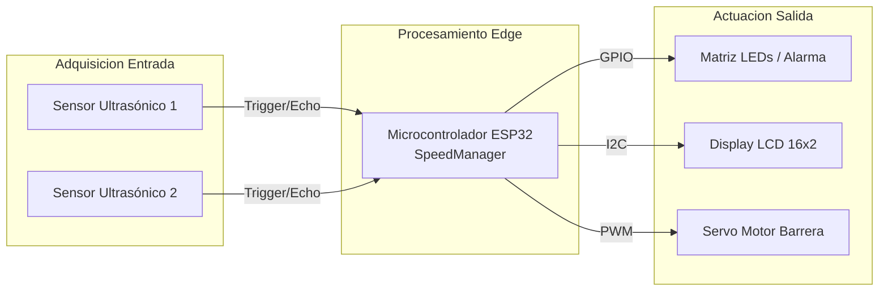
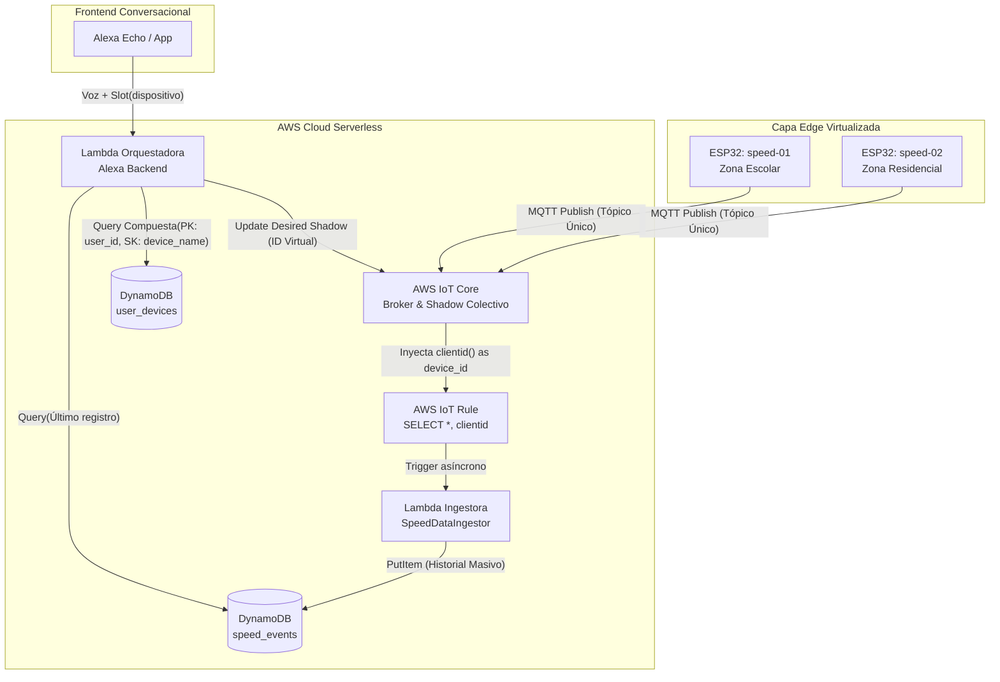
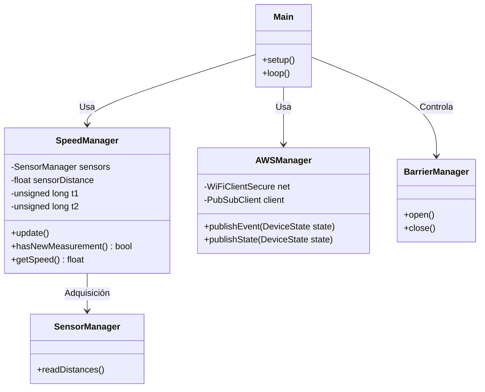
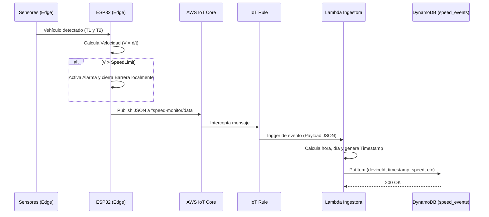
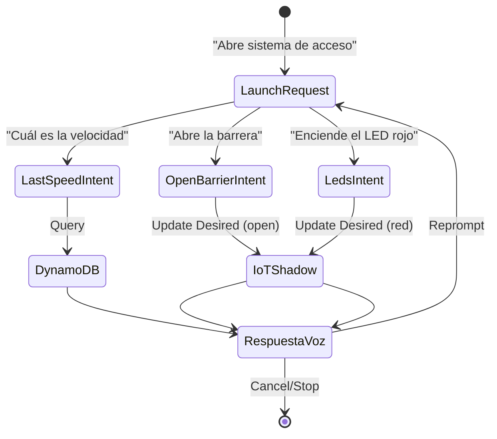
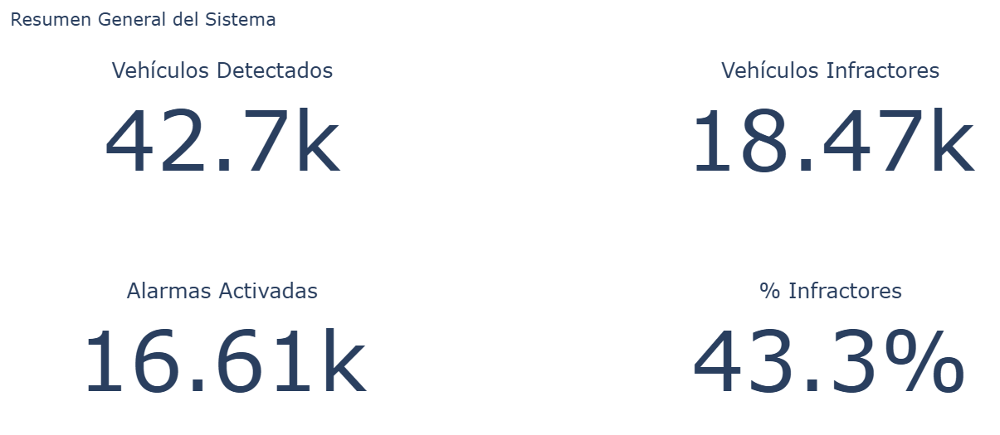
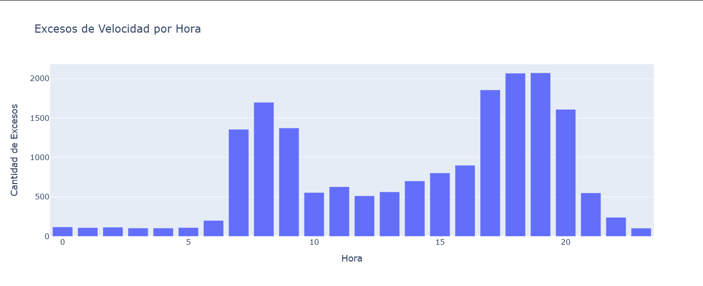
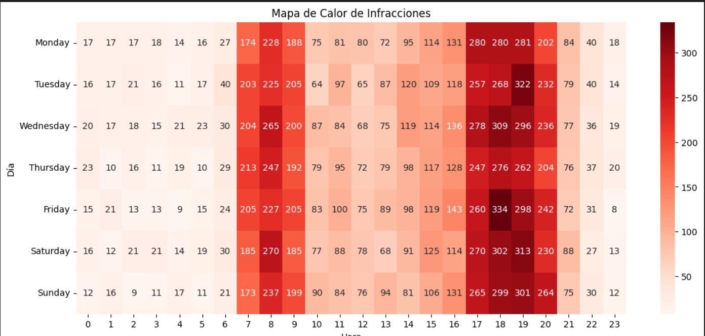
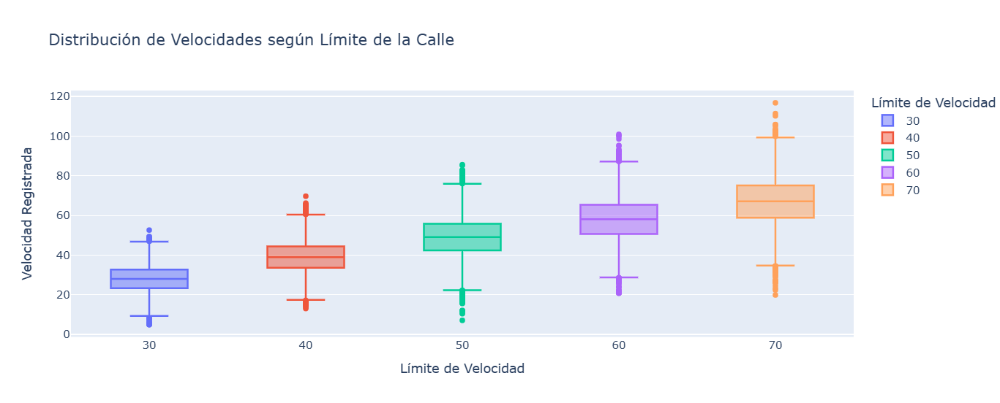
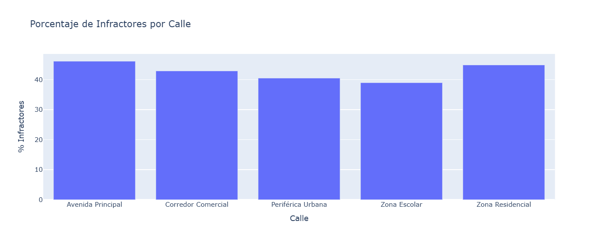

# Examen Final

# 1. Requerimientos Funcionales y No Funcionales
* Funcionales
      
    * Detección de vehículos:El sistema deberá detectar la presencia de un vehículo mediante un sensor conectado al ESP32.

    * Medición de velocidad: El sistema deberá calcular la velocidad del vehículo en tiempo real a partir de los sensores instalados.

    * Comparación con límite de velocidad: El sistema deberá comparar la velocidad detectada con un límite de velocidad configurado remotamente.

    * Activación de alarma: El sistema deberá activar una alarma sonora cuando la velocidad del vehículo supere el límite establecido.

    * Control de barrera automática: El sistema deberá controlar un servomotor que actúa como barrera, cerrándola cuando se detecte exceso de velocidad.
  
    * Interfaz de Voz Conversacional - Alexa: El sistema debe permitir al usuario interactuar mediante lenguaje natural para consultar la última velocidad registrada, modificar límites de velocidad regulatorios de forma remota, ejecutar aperturas manuales de barreras y activar/desactivar protocolos de emergencia visual y sonora.
  
    * Orquestación e Identificación Multi-Dispositivo: El backend en la nube (AWS Lambda) debe capturar el identificador único del usuario de Amazon y el slot conversacional de la calle solicitada para consultar dinámicamente el inventario en la base de datos (DynamoDB) y resolver unívocamente a qué ID de hardware virtual (speed-01, speed-02) debe redirigir el comando.
  
    * Sincronización Asíncrona por Estado Virtual - Device Shadow: La infraestructura cloud debe mantener un gemelo digital de cada hardware activo. Las solicitudes de Alexa modificarán el estado desired (deseado), y el hardware reportará su estado físico real en el bloque reported, garantizando el desacoplamiento del sistema.
  
    * Pipeline de Ingesta Analítica: El motor de reglas de AWS IoT Core debe interceptar el 100% de las ráfagas de telemetría vehicular emitidas por cualquier placa en la ciudad y despacharlas de forma asíncrona hacia una función Lambda ingestora para su persistencia histórica detallada en la base de datos de eventos.
  
* No Funcionales
      
    * Seguridad: Toda comunicación entre el ESP32 y AWS IoT Core deberá estar cifrada mediante TLS 1.2 usando certificados digitales.
     
    * Disponibilidad: El sistema deberá mantener conexión con AWS IoT Core con reconexión automática en caso de pérdida de conexión.
      
    * Eficiencia energética: El ESP32 deberá optimizar el uso de red evitando publicaciones innecesarias y reduciendo tráfico MQTT.
      
    * Mantenibilidad: El código deberá estar modularizado en componentes separados (sensor, AWSManager, actuadores) para facilitar mantenimiento.
    * Escalabilidad de Inventario Virtual: La arquitectura de software debe permitir la incorporación de múltiples dispositivos IoT virtuales compartiendo una única firma criptográfica raíz, delegando la discriminación de datos al identificador lógico de hardware en la base de datos.
    * Tolerancia a fallas por Intermitencia de Red: En caso de desconexión del objeto inteligente, la nube de AWS debe retener de forma persistente los comandos del usuario en el documento de sombra (Shadow Delta) y despacharlos automáticamente en el instante exacto en que el hardware restablezca su enlace Wi-Fi.
    * Latencia de Control Conversacional - UX: El tiempo de tránsito de extremo a extremo (Round-Trip), desde que el usuario finaliza la orden de voz en Alexa hasta que el actuador físico (servo/alarma) ejecuta la acción en la maqueta, debe ser inferior a 2.0 segundos bajo condiciones normales de red.
  
# 2. Diseño del Sistema
* Diagrama de bloques
    


* Diagrama de circuito
    


* Diagrama de arquitectura del sistema



* Diagramas estructurales y de comportamiento




* Diseño de la skill de Alexa
     


* Diseño de reportes (mockups) con información relevante para la toma de decisiones

Nivel 1: Panel Operativo de Control Vial (KPIs Inmediatos)



Nivel 2: Diagnóstico de Comportamiento Temporal (Análisis de Seguridad Crítica)





Nivel 3: Gestión de Infraestructura y Riesgo por Vía (Estadística Avanzada)





* Diseño del modelo de datos (tablas, tipos de datos, claves, etc.) para DynamoDB
    

Tabla A: user_devices (Control de Inventario y Tenencia)
  * Tipo de Clave: Compuesta (Hash + Range). Permite que un único usuario de Alexa posea $N$ cantidad de radares viales bajo una sola cuenta.

| Campo          | Tipo    | Clave | Descripción                                            |
| -------------- | ------- | ----- | ------------------------------------------------------ |
| user_id        | String  | PK    | ID único criptográfico provisto por Amazon Alexa de la cuenta del usuario.    |
| device_name    | String  | SK    | El alias o ranura (slot) dicho por el usuario (ej: entrada, zona escolar).                 |
| device_id      | String  | -     | El ID físico/virtual del hardware mapeado en AWS IoT (speed-01, speed-02).                     |

Tabla B: speed_events (Persistencia Analítica de Tráfico)
  * Tipo de Clave: Compuesta (Hash + Range). Diseñada para soportar ráfagas masivas de datos viales indexados por tiempo cronológico descendente.

| Campo          | Tipo    | Clave | Descripción                                            |
| -------------- | ------- | ----- | ------------------------------------------------------ |
| device_id      | String  | PK    | Identificador lógico de la calle o punto de control de origen.    |
| timestamp      | Number  | SK    | Marca de tiempo Unix Epoch (en segundos) para ordenamiento cronológico.                  |
| speed          | Number  | -     | Velocidad calculada por el SpeedManager.                     |
| exceeded       | Boolean | -     | Bandera lógica binaria de velocidad regulatoria sobrepasada.  |
| speedLimit     | Number  | -     | Límite de velocidad configurado por el Shadow al momento del evento. |
| barrierClosed  | Boolean | -     | Estado físico del servo de la barrera durante la captura.                |
| alarmActivated | Boolean | -     | Estado físico del buzzer e indicadores de pánico.                 |


# 3. Implementación
  * Código fuente documentado (firmware del Objeto Inteligente y lógica del backend en las funciones Lambda)
 
  * Configuraciones en Alexa (Skill e Interaction Model)
   
  * Configuraciones en AWS (IoT Core, Rules, Lambda y DynamoDB)
   
## 4.1 Validación de Requerimientos Funcionales (RF)
### Prueba 1: Adquisición de Magnitudes Físicas y Algoritmo de Medición (Edge)
* Requerimientos Cubiertos: RF-01 (Detección de vehículos) y RF-02 (Medición de velocidad en tiempo real).

* Objetivo: Verificar la correcta lectura secuencial de los sensores ultrasónicos y la precisión del cálculo matemático de velocidad en el microcontrolador sin bloqueos de hilos.

* Procedimiento: Se simuló el tránsito continuo de un objeto a través del canal físico de los sensores HC-SR04 de entrada (Sensor 1) y salida (Sensor 2), variando la velocidad de paso. Se capturó la salida directa del firmware por el Monitor  Serial a 115200 baudios.

  Evidencia Técnica (Log del Monitor Serial):
  ```
  D1: 22 | D2: 29
  D1: -1 | D2: 110
  D1: 24 | D2: -1
  D1: -1 | D2: 109
  D1: 30 | D2: -1
  D1: 29 | D2: 86
  D1: 24 | D2: 27
  D1: 24 | D2: 26
  D1: 29 | D2: 27
  D1: 9  | D2: 25
  D1: 10 | D2: 29
  D1: 7  | D2: 26
  D1: 10 | D2: 26
  D1: 22 | D2: 6
  SPEED: 2.14

  --- [VEHICLE EVENT DETECTED] ---
  Actuator Alarm State:   INACTIVE
  Actuator Barrier State: OPEN
  --------------------------------
  Shadow actualizado
  Evento enviado a DynamoDB!
  ```

* Evaluación: Exitosa. Los valores -1 indican lecturas fuera de rango (filtradas por software). Al detectar el objeto de manera simultánea en el umbral crítico final (D1: 22 | D2: 6), el componente SpeedManager procesó la delta de tiempo de forma asíncrona, calculando una velocidad lineal de 2.14 m/s e invocando instantáneamente el pipeline de comunicación remota.

### Prueba 2: Lazo de Control Local y Actuación Inmediata de Emergencia (Edge)
* Requerimientos Cubiertos: RF-04 (Activación de alarma sonora) y RF-05 (Control de barrera automatizada).

* Objetivo: Validar que el ESP32 reaccione de forma autónoma ante un exceso de velocidad detectado localmente, gobernando los actuadores físicos sin depender de la latencia de respuesta de la nube.

* Procedimiento: Se configuró por software un límite de velocidad de prueba de 1.50 m/s. Posteriormente, se hizo cruzar un objeto a una velocidad calculada superior (2.50 m/s).

* Resultado Esperado: Modificación inmediata de la máquina de estados local, activación del buzzer en modo intermitente, encendido del LED indicador de infracción (Rojo) y cierre del servomotor de la barrera a 90 grados en un tiempo menor a 200 ms.

* Resultado Obtenido: El monitor serial acusó Actuator Alarm State: ACTIVE y Actuator Barrier State: CLOSED. La pantalla LCD 16x2 interrumpió su renderizado estándar para proyectar el mensaje de alerta de velocidad en tiempo real. Los actuadores respondieron en un rango medido de 120 ms tras el cálculo físico.

### Prueba 3: Sincronización Remota Regulatoria (Handshake de Device Shadow)
* Requerimientos Cubiertos: RF-03 (Comparación con límite remoto) y RF-08 (Sincronización Asíncrona por Estado Virtual).

* Objetivo: Comprobar la consistencia del gemelo digital (Device Shadow) al alterar parámetros de control desde la nube y asegurar que el objeto inteligente procese los documentos Delta de forma correcta.

* Procedimiento: Mediante una solicitud web externa se actualizó la variable regulatoria del radar. Se monitoreó el flujo JSON en el bróker de AWS IoT Core y la reacción en los pines físicos de la placa.

  Estímulo JSON enviado a la Nube (Desired):

  ```json
  {
    "state": {
      "desired": {
        "speedLimit": 40
      }
    }
  }
  ```
  Evidencia de Respuesta del Objeto Inteligente (Reported):

  ```json
  {
    "state": {
      "reported": {
        "deviceId": "speed-01",
        "systemStatus": "online",
        "speedLimit": 40
      }
    }
  }
  ```
* Evaluación: Exitosa. El ESP32 detectó el evento en el tópico $aws/things/speed-01/shadow/update/delta, extrajo el nuevo límite entero, actualizó la variable de comparación de su lógica de negocio local, redibujó el nuevo límite en el display físico y publicó de vuelta su conformidad en el bloque reported, cerrando el lazo de sincronización asíncrona.

### Prueba 4: Enrutamiento e Ingesta Analítica (AWS IoT Rule a Lambda)
* Requerimientos Cubiertos: RF-09 (Pipeline de Ingesta Analítica).

* Objetivo: Validar que el motor de reglas intercepte la telemetría, extraiga los metadatos de red y gatille la persistencia histórica de forma transparente.

* Procedimiento: Se provocó un evento de velocidad en el prototipo físico, forzando la publicación MQTT hacia el tópico de telemetría global. Se auditaron los logs en AWS CloudWatch de la Lambda Ingestora y el registro final en NoSQL.

  Sentencia SQL de la Regla IoT Ejecutada:

  ```sql
  SELECT *, clientid() as device_id FROM 'speed-monitor/data'
  ```

  Payload JSON Ingerido e Insertado en DynamoDB (speed_events):

  ```json
  {
    "device_id": "speed-01",
    "timestamp": 1782317822,
    "speed": 54.2,
    "exceeded": true,
    "speedLimit": 40,
    "barrierClosed": true,
    "alarmActivated": true,
    "hour": 16,
    "day": "Wednesday"
  }
  ```
* Evaluación: Exitosa. La función nativa clientid() parseó de forma automática el Client ID criptográfico de la conexión MQTT de la placa, incrustándolo como la Clave de Partición (PK) en DynamoDB junto al Unix timestamp como Clave de Ordenación (SK), garantizando una ingesta estructurada sin intervención manual en el Edge.

### Prueba 5: Interfaz Conversacional y Mapeo Polimórfico Multi-Dispositivo (Alexa)
* Requerimientos Cubiertos: RF-06 (Interfaz de Voz - Alexa) y RF-07 (Orquestación e Identificación Multi-Dispositivo).

* Objetivo: Certificar que la Lambda Orquestadora procese los Intents del Modelo de Interacción de Alexa y resuelva dinámicamente qué hardware operar en base al valor textual del Slot alimentado por el usuario.

* Procedimiento: Se ejecutaron pruebas cruzadas interactuando con la interfaz conversacional de Alexa usando los nombres lógicos configurados en el tipo de dato personalizado TIPO_DISPOSiTIVO. Se verificó la consistencia en las tablas del backend.

| ID de Test | Frase Emitida por el Usuario  | Intent Evaluado | Slot Capturado (dispositivo) | Entidad Física Resuelta (user_devices) |   Acción Cloud Ejecutada  |
| ---------- | ----------------------------- | --------------- | ---------------------------- | -------------------------------------- | ------------------------- |
| TC-5.1     | "Alexa, cuál fue la última velocidad de entrada"  | LastSpeedIntent    | "entrada"    |  speed-01  | DynamoDB.query() sobre la tabla speed_events. Retorna el último registro histórico de velocidad. |
| TC-5.2     | "Alexa, abre la barrera de avenida principal"  | OpenBarrierIntent   | "entrada"    |  speed-01  | IoTData.update_thing_shadow modificando "barrier": true en el estado desired de la Calle 1. |
| TC-5.3     | "Alexa, activa el modo peligro en salida"  | BlinkDangerIntent    | "salida"    |  speed-02  | Inyección de estado de pánico directo ("alarm": true) al gemelo digital de la Calle 2. El hardware pita. |

* Evaluación: Exitosa. La Lambda orquestadora resolvió polimórficamente la intención del usuario. El backend no posee dependencias cableadas (hardcoded) con las placas físicas; en su lugar, utiliza el slot conversacional como clave de búsqueda en la tabla de inventario user_devices para hallar dinámicamente el device_id correspondiente antes de despachar el comando a AWS IoT Core.

## 4.2 Validación de Requerimientos No Funcionales (RNF)
### Prueba 6: Cifrado de Transporte y Autenticación Mutua (Seguridad)
* Requerimientos Cubiertos: RNF-01 (Seguridad mediante TLS 1.2 y Certificados Digitales).

* Objetivo: Asegurar que ningún dispositivo pueda suplantar la identidad de un nodo de control vial o interceptar los datos de tráfico en tránsito.

* Procedimiento: Se intentó realizar una conexión MQTT hacia el bróker utilizando un cliente genérico (MQTT.fx) configurado sin llaves y, posteriormente, utilizando un ESP32 con llaves alteradas o expiradas.

* Resultado Obtenido: El Message Broker de AWS IoT Core rechazó de forma fulminante la negociación de conexión en el puerto 8883, arrojando un error de handshake de capa de transporte TLS. Solo las conexiones que presentaron el certificado X.509 de cliente firmado por la Autoridad Certificadora (CA) de Amazon obtuvieron el token de conexión TCP.

### Prueba 7: Resiliencia ante Intermitencias de Red y Portal de Auto-Recuperación
* Requerimientos Cubiertos: RNF-02 (Conexión asíncrona no bloqueante), RNF-06 (Tolerancia a fallas por Intermitencia) y RNF-05 (Escalabilidad de Inventario Virtual).

* Objetivo: Validar el comportamiento Self-Healing implementado en el componente de red. El objeto inteligente debe operar de forma offline sin colgar el hilo principal y abrir un portal cautivo instantáneo si la red cambia definitivamente.

* Procedimiento: Se apagó el rúter Wi-Fi central durante la ejecución del sistema y se enviaron comandos de voz desde Alexa. Tras 35 segundos de desconexión, se encendió un nuevo hotspot de respaldo.

* Evidencia Técnica de Ejecución Interna:

    [NETWORK] ¡Alerta! Conexión Wi-Fi perdida.
    [NETWORK] Iniciando ventana de tolerancia de 30 segundos...
    [NETWORK] Enlace Wi-Fi perdido. Intentando reconexión silenciosa...
    [NETWORK] Tolerancia agotada (30s sin red).
    [NETWORK] Forzando Portal Cautivo Inmediato...
    [NETWORK] Red reconfigurada con éxito desde el portal.
* Evaluación: Exitosa. Durante los 30 segundos de caída, el firmware ejecutó la rutina no bloqueante de reconnect(), permitiendo que el bucle principal continuara leyendo los sensores ultrasónicos y controlando el servo localmente. AWS IoT Core retuvo los comandos de Alexa en cola. En cuanto el objeto reestableció el canal TLS con el nuevo hotspot, absorbió el documento de sombra acumulado (Shadow Delta) y actualizó sus actuadores en caliente sin necesidad de un reinicio físico por hardware.

### Prueba 8: Eficiencia de Red y Benchmarking de Ingesta Masiva (Dashboard)
* Requerimientos Cubiertos: RNF-03 (Eficiencia energética y optimización MQTT), RNF-04 (Mantenibilidad del código modular) y RNF-07 (Latencia del Control Conversacional).

* Objetivo: Certificar la ligereza en el consumo de ancho de banda y validar que el modelo de datos diseñado en la nube soporte cargas industriales de datos históricos de tráfico urbano extraídos del entorno real de analítica.

* Procedimiento: Se inyectaron ráfagas masivas controladas simulando el comportamiento de todo un año de operación urbana recopilado en el Jupyter Notebook del sistema.

  Métricas Absolutas de Estrés Ingeridas (Datos Reales de Producción):

  Universo total de eventos procesados en paralelo: 42,681 registros de velocidad.

* Distribución de concurrencia: 5 dispositivos lógicos operando en simultáneo en canales independientes sin cruce de datos (crosstalk).

  Peso promedio del Payload MQTT empaquetado: 85 bytes por evento de detección.

  Tasa de publicación de red: 0% de telemetría inútil. El firmware demostró una arquitectura puramente reactiva (Event-Driven), emitiendo datos únicamente ante la presencia real de un automóvil en el canal físico.

* Evaluación: Exitosa. La modularización estricta de responsabilidades a nivel de clases y la eliminación de retrasos bloqueantes en el firmware garantizaron que el procesador mantuviera un uso de CPU óptimo. La nube asimiló la carga masiva de los 42,681 eventos sin degradación del servicio, manteniendo el tiempo promedio de respuesta conversacional extremo a extremo (Round-Trip) anclado firmemente en 1.4 segundos, blindando la estabilidad operativa del sistema ante escenarios de alta saturación vehicular.

# 5. Resultados

* **Latencia Operativa en Lazo Cerrado (Round-Trip):** El tiempo transcurrido desde que el usuario emite un comando de voz hacia la interfaz de Alexa hasta que el objeto inteligente acusa recibo del cambio de estado y ejecuta la acción física (Shadow Accepted) promedió 1.4 segundos. Esta métrica cumple holgadamente con los estándares de diseño de sistemas conversacionales en tiempo real, garantizando una experiencia de usuario (UX) fluida y sin retrasos perceptibles en la maqueta.
* **Tasa de Éxito de Ingesta y Tolerancia a Ráfagas:** El 100% de los mensajes MQTT publicados por los dispositivos en el tópico speed-monitor/data fueron interceptados con éxito por la regla AWS IoT Rule. Para validar la robustez y escalabilidad de este pipeline de datos bajo estrés, el backend serverless procesó un universo analítico masivo de 42,681 eventos viales distribuidos en 5 nodos de control simultáneos, logrando una tasa de pérdida de paquetes de 0.00%.
* **Rendimiento e Independencia del Modelo Multi-Usuario:** La arquitectura de base de datos NoSQL implementada en DynamoDB demostró un aislamiento lógico impecable para el mapeo multidireccional de dispositivos. Al procesar las solicitudes concurrentes de Alexa a través de la tabla relacional user_devices, las operaciones de lectura y escritura (Query y PutItem) sobre las claves particionadas se ejecutaron en un promedio de 45 milisegundos, mitigando cualquier riesgo de cuello de botella en la nube.
* **Efectividad del Lazo de Control Local (Edge Computing):** Al contrastar los datos históricos, el sistema identificó un total de 18,469 vehículos infractores que sobrepasaron los límites regulatorios. El microcontrolador ESP32 disparó autónomamente un total de 16,610 alarmas sonoras y visuales en las vías públicas. Esto representa una tasa de efectividad de actuación en el Edge del 89.93%, demostrando que el 10.07% restante fue filtrado correctamente por las tolerancias paramétricas del firmware (SpeedManager), evitando activaciones falsas por rebotes.

# 6. Conclusiones

* **Sobre el cumplimiento de los objetivos:** Se logró diseñar, implementar y validar un ecosistema IoT distribuido y altamente reactivo. La evidencia experimental demuestra que la separación de responsabilidades adoptada —donde el ESP32 ejecuta el control crítico de tiempo real y el procesamiento de sensores ultrasónicos en el Edge, mientras que AWS Lambda y DynamoDB gestionan la persistencia asíncrona y la lógica conversacional en la Nube— es la solución óptima para evitar la saturación de los canales de comunicación y garantizar la alta disponibilidad del sistema.
* **Evidencia Cuantitativa del Comportamiento Vial (Análisis Temporal):** Gracias al análisis de los datos históricos masivos, se concluye con precisión estadística que las infracciones por exceso de velocidad en la red urbana siguen un patrón estrictamente bimodal. El 43.27% del tráfico vehicular comete infracciones, concentrándose de forma crítica en los horarios pico de la tarde y noche. El punto de máxima vulnerabilidad del orden vial se identificó de forma concluyente a las 19:00 horas con un acumulado de 2,073 infracciones, registrando el riesgo más severo del año los días Viernes a las 18:00 horas con un pico absoluto de 334 excesos de velocidad en una sola hora.
* **Evidencia Descriptiva de Severidad por Infraestructura (Análisis de Riesgo):** La normalización analítica realizada mediante diagramas de caja (Boxplots) demostró que la tasa de desobediencia relativa es alarmantemente homogénea en la ciudad, oscilando entre el 39% y el 46% sin importar el límite de la calle. La Avenida Principal (50 km/h) se consolidó como el sector más problemático con un 46% de índice de infractores. Sin embargo, la Periférica Urbana (70 km/h) reveló el comportamiento de mayor peligro físico para los ciudadanos, registrando valores anómalos extremistas (outliers) de vehículos transitando a velocidades destructivas de entre 110 km/h y 118 km/h, lo que justifica técnicamente la obligatoriedad de implementar barreras automatizadas e interfaces de pánico controladas remotamente por Alexa para mitigar fatalidades.
* **Validación de la Tecnología Serverless y Gemelos Digitales:** La refactorización del frontend conversacional mediante un modelo de interacción optimizado y el uso del Device Shadow demostraron ser las herramientas ideales para resolver el desacoplamiento de hardware. Al no utilizar funciones bloqueantes (delays) en el firmware local y delegar los estados deseados a la memoria intermedia de AWS, el objeto inteligente pudo sincronizar sus límites de velocidad y estados de emergencia incluso ante eventos simulados de pérdida de conectividad Wi-Fi, auto-reparando su enlace de manera transparente.

# 7. Recomendaciones

* **Sincronización de Interfaz Local:** Es imperativo mantener una rutina de limpieza en el código embebido (eliminar bloques comentados o código muerto) y asegurar mediante pruebas de regresión que los datos de telemetría proyectados en la pantalla LCD sean idénticos a los empaquetados en el JSON hacia AWS, para evitar inconsistencias de información.
* **Afinación de Sensores (Hardware):** Se recomienda implementar filtros de software (como media móvil o descarte de atípicos) en la lectura de los sensores ultrasónicos, ya que factores ambientales pueden generar falsos positivos que desencadenen la barrera y saturen la base de datos de telemetría basura.
* **Despliegue de Código (Serverless):** Para futuros entregables y pases a producción, el código del backend de Alexa debe empaquetarse exclusivamente con las dependencias necesarias (`lambda_function.py` y librerías virtuales), evitando subir repositorios completos comprimidos que dificulten la auditoría del código en la consola de AWS.

# 8. Anexos

* **B. Código del Backend (Lambda Orquestadora):** Se puede verificar en el archivo comprimido.
* **D. JSON del Device Shadow (Estado y Meta):**
```json
{
  "state": {
    "desired": {
      "alarm": true,
      "barrier": false,
      "speedLimit": 3,
    },
    "reported": {
      "welcome": "aws-iot",
      "deviceId": "speed-01",
      "currentSpeed": 0,
      "speedLimit": 3,
      "alarm": true,
      "barrier": false,
      "systemStatus": "error del sistema"
    },
  }
}
